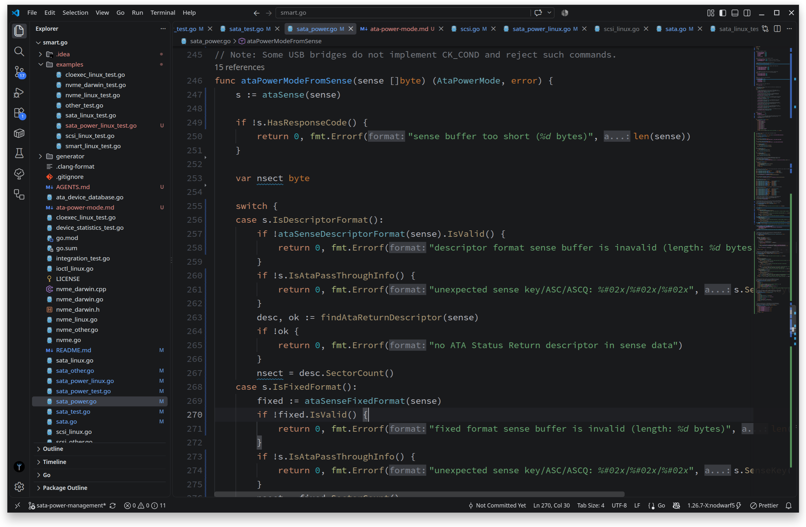

# Islands Theme

[](https://marketplace.visualstudio.com/items?itemName=congard.vsc-islands-theme)

JetBrains-inspired Visual Studio Code theme.

The Islands theme is based on [zed-theme-jetbrains](https://github.com/artemevsevev/zed-theme-jetbrains.git).

> [!NOTE]
> Go support is the first priority; other languages will be added in the future.

> [!NOTE]
> In Go, a method receiver parameter emits the same token as a regular function parameter. So it's impossible to distinguish them for now.



Font: [IBM Plex Mono](https://fonts.google.com/specimen/IBM+Plex+Mono)
<br>Icons: [JetBrains New UI File Icon Theme Extended](https://marketplace.visualstudio.com/items?itemName=fogio.jetbrains-file-icon-theme)

## Build

This project is a Visual Studio Code theme extension. It can be built and packaged into a `.vsix` installable using the VS Code CLI.

### Prerequisites

- [Node.js](https://nodejs.org/)
- [VS Code](https://code.visualstudio.com/)

### Install dependencies

```bash
npm install
```

### Package

```bash
npm run package
```

### Install locally

```bash
code --install-extension ./islands-theme-X.Y.Z.vsix
```